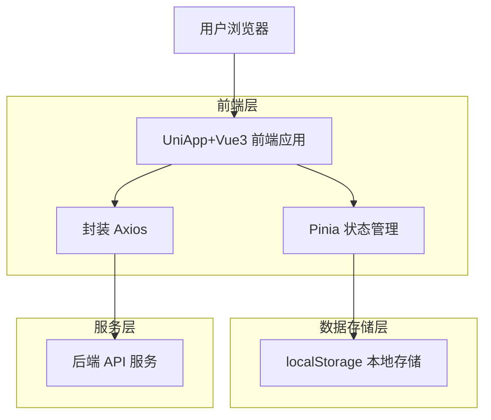
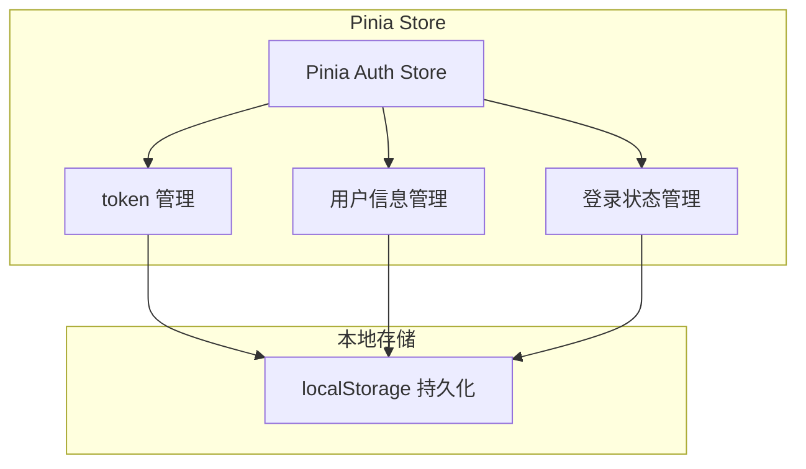

## 1. 架构设计



## 2. 技术描述
- 前端：UniApp + Vue3 + Element Plus
- 状态管理：Pinia
- HTTP客户端：封装 Axios
- 初始化工具：HBuilderX（UniApp 官方开发工具）
- 后端：通过 API 接口提供登录验证服务

## 3. 路由定义
| 路由 | 用途 |
|-------|---------|
| /pages/login/login | 登录页面，员工账号密码登录 |
| /pages/index/index | 首页，登录成功后的主界面 |

## 4. API 定义

### 4.1 核心 API

员工登录接口
```
POST /api/auth/login
```

请求参数：
| 参数名 | 参数类型 | 是否必需 | 描述 |
|-----------|-------------|-------------|-------------|
| username | string | 是 | 员工账号 |
| password | string | 是 | 登录密码 |

响应参数：
| 参数名 | 参数类型 | 描述 |
|-----------|-------------|-------------|
| code | number | 响应状态码（200成功） |
| message | string | 响应消息 |
| data | object | 响应数据 |
| data.token | string | JWT token |
| data.user | object | 员工信息 |

示例：
```json
// 请求
{
  "username": "employee001",
  "password": "123456"
}

// 响应
{
  "code": 200,
  "message": "登录成功",
  "data": {
    "token": "eyJhbGciOiJIUzI1NiIsInR5cCI6IkpXVCJ9...",
    "user": {
      "id": 1,
      "username": "employee001",
      "name": "张三",
      "role": "employee"
    }
  }
}
```

### 4.2 TypeScript 类型定义
```typescript
// 登录请求参数
interface LoginRequest {
  username: string
  password: string
}

// 登录响应数据
interface LoginResponse {
  code: number
  message: string
  data: {
    token: string
    user: UserInfo
  }
}

// 用户信息
interface UserInfo {
  id: number
  username: string
  name: string
  role: string
}

// Pinia Store 状态
interface AuthState {
  token: string
  userInfo: UserInfo | null
  isLogin: boolean
}
```

## 5. 状态管理架构



## 6. 封装 Axios 配置

### 6.1 请求拦截器
- 自动添加 token 到请求头
- 统一处理请求格式

### 6.2 响应拦截器
- 统一处理响应数据格式
- 错误处理和提示
- token 过期处理

### 6.3 基础配置
```typescript
// axios 基础配置
const request = axios.create({
  baseURL: process.env.VUE_APP_BASE_API,
  timeout: 10000,
  headers: {
    'Content-Type': 'application/json'
  }
})
```

## 7. 组件架构

### 7.1 页面组件
- LoginPage: 登录页面组件
- IndexPage: 首页组件

### 7.2 业务组件
- LoginForm: 登录表单组件
- UserInfo: 用户信息展示组件
- NavigationMenu: 导航菜单组件

### 7.3 通用组件
- HttpRequest: 封装的 Axios 请求方法
- AuthGuard: 登录状态验证组件